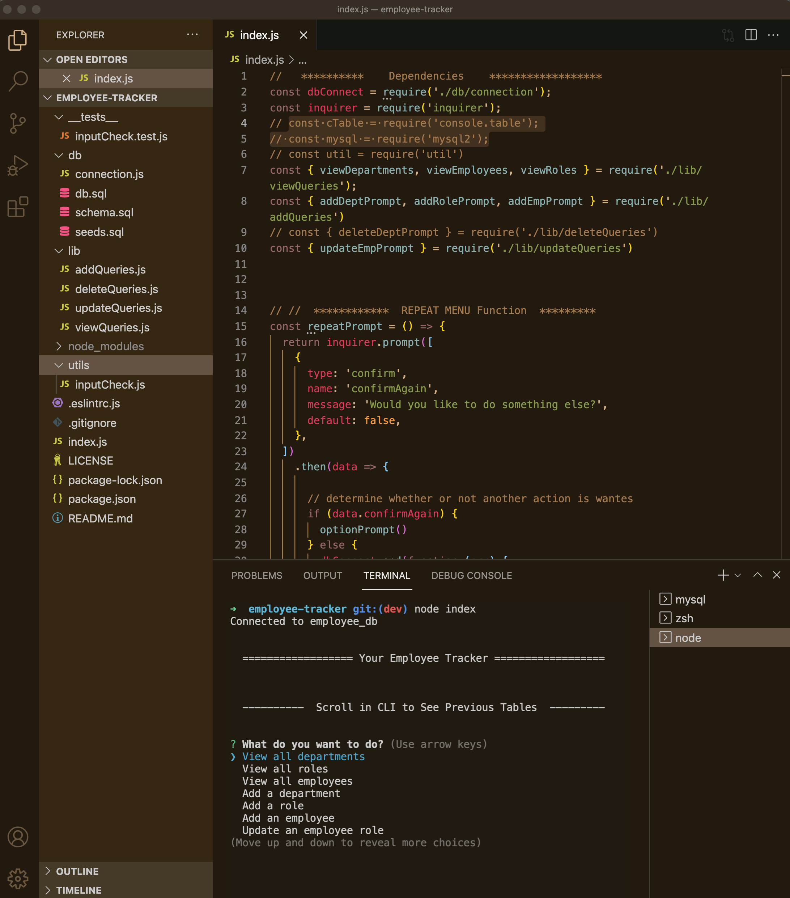

# **
Employee Tracker
**

**
FEATURES
**

      

&nbsp;

## **Project Description**

---

This command-line app allows users to view, create, and update a company’s typical employee database. Upon start, the application renders a detailed menu in the command-line from which the user chooses to view or add Departments, Roles and Employees, or update employees.

&nbsp;

## Table of Contents

---

- [Installation](#installation)
- [Usage](#usage)
- [URL](#url)
- [Screenshot](#screenshot)
- [Contributing](#contributing)
- [Tests](#tests)
- [Resources](#resources)
- [Questions](#questions)
- [License](#license)

&nbsp;

## **Installation**

---

See package.json for dependencies and other details.

`git clone`
Code to local directory
&nbsp;

`npm install`
From command line npm install the following:

- Node
- Inquirer
- MySql/MySql2
- console.table
  &nbsp;

`mysql -u <username> -p`
If need to re-seed the database ~ 
From the command-line, run the above mysql command to start mysql. Enter password (see connection file) 
Database is employee_db
In mySql command-line shell -

- enter: USE employee_db;
- then run: source db/schema.sql;
- followed by: source db/seeds.sql;

the from command-line and in the root directory, run app as usual with: node index
&nbsp;

`node index`
To start the app ~
From the command-line and in program root directory, type: node index.
&nbsp;

## **Usage**

---

- Use arrow keys to scroll up or down in the main menu.
- Press enter to select an option.
- Follow the prompts.
- Enter numbers only for salary question. App will remind you if needed! If you get the warning, be sure to backspace to a clear line before typing the entry again.
- To exit, choose 'Exit' from the main menu, answer 'No' to the follow-up question, or use command-line exit keyboard short-cuts at any time.

&nbsp;

## **URL**

---

Does not have a deployment URL.

&nbsp;

## **Screenshot**

---

&nbsp;

### **Contributing**

---

Not accepting contributors.

&nbsp;

### **Tests**

---

No tests at this time.

&nbsp;

### **Resources**

---

### Sources I Used or Was Inspired By

https://stackoverflow.com/questions/23259168/what-are-express-json-and-express-urlencoded

&nbsp;

###### Mysql

https://www.javatpoint.com/mysql-self-join

https://www.mysqltutorial.org/mysql-self-join/](https://www.mysqltutorial.org/mysql-self-join/)

https://www.mysqltutorial.org/mysql-uuid/

https://pencilprogrammer.com/self-referencing-foreign-key-in-mysql/

https://smarttechways.com/2021/12/01/error-1452-23000-cannot-add-or-update-a-child-row-a-foreign-key-constraint-fails/

https://www.w3schools.com/sql/sql_insert.asp

https://www.youtube.com/watch?v=ck8mVDOOCCg

&nbsp;

###### References for Promises & Error catching

https://github.com/mcintyrehh/bamazon/blob/master/bamazonCustomer.js

https://javascript.plainenglish.io/how-to-inquirer-js-c10a4e05ef1f

https://stackoverflow.com/questions/59905401/inquirer-responses-used-in-inserted-to-database-with-mysql

https://www.w3schools.com/js/js_promise.asp

&nbsp;

###### General Coding

https://github.com/nicolewallace09/employee-tracker/blob/master/server.js

https://gomakethings.com/how-to-reorder-an-item-in-an-array-with-vanilla-js/

https://www.youtube.com/watch?v=oLZcnyK-EpE

&nbsp;

###### References for README File styling

https://github.com/jpd61/employee-tracker

&nbsp;

### **Questions**

---

Reach me directly at mongabay00@outlook.com    
Or checkout out my GitHub profile: [github.com/MellieDee](https://github.com/MellieDee)

&nbsp;

### **License**

---

Copyright (c) Melanie Dubberley.
&nbsp;

Licensed under the [MIT](https://choosealicense.com/licenses) license.

&nbsp;

##### Return to:

---

- [Installation](#installation)
- [Usage](#usage)
- [URL](#url)
- [Screenshot](#screenshot)
- [Contributing](#contributing)
- [Tests](#tests)
- [Resources](#resources)
- [Questions](#questions)
- [License](#license)

&nbsp;
